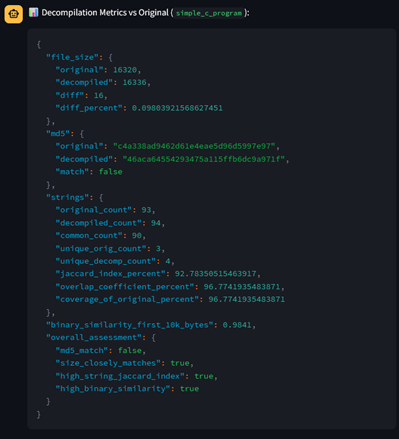

# LLM-Powered Reverse Engineering Tool

[](https://opensource.org/licenses/MIT)

An advanced reverse engineering tool that leverages the power of Large Language Models (LLMs) combined with the `radare2` analysis framework to decompile, analyze, and understand C/C++ binaries. The project features an intuitive graphical interface built with Streamlit, providing a seamless workflow for reverse engineers and security analysts.

This tool was created as part of the project "LLM – code translation and reverse engineering" by Michał Jurzak.

## ✨ Key Features

### Core Functionality

- **LLM-Powered Decompilation**: Takes a compiled C binary as input and uses an LLM to generate high-level, commented C/C++ code.
- **`radare2` Integration**: The LLM uses a suite of `radare2` tools to perform deep binary analysis, including:
  - Full program analysis (`aaa`)
  - Function, string, and import/export listing
  - Memory inspection at specific addresses
  - High-quality decompilation
- **Model Flexibility**: Easily switch between OpenAI models (like GPT-4) and locally hosted models via Ollama.
- **Code Reconstruction & Compilation**: Extract the decompiled code, recompile it, and view comparison metrics against the original binary.
- **Automated Documentation**: Automatically generate comments for the decompiled code and create a `README.md` file upon successful compilation.

### Graphical User Interface (Streamlit)

- **Interactive File/Folder Selection**: Easily select a single binary or a folder of binaries for analysis.
- **Real-time Tool Logging**: Observe in real-time which `radare2` tools the LLM agent is using and see their outputs.
- **Conversation Management**: Save, load, and delete entire analysis sessions and conversations.

### Explainable AI (XAI) & Visualization

- **Detailed Explanations**: The "Explain in Detail" option provides a structured table breaking down various aspects of the decompilation.
- **Tool Usage Visualization**: Generates a dynamic graph illustrating the sequence of tool calls made by the LLM agent during its analysis.

## 📸 Screenshots

| GUI Interface & Real-time Logging  |    Recompilation & Code Metrics     |
| :--------------------------------: | :---------------------------------: |
|  |  |

| Explainable AI (XAI) Table |           Tool Usage Visualization           |
| :------------------------: | :------------------------------------------: |
|      |  |

|            Auto-generated README.md            |
| :--------------------------------------------: |
|  |

## 🚀 Getting Started

There are two primary ways to run the application: using Docker (recommended for ease of use) or running directly from the source code.

### Method 1: Running with Docker (Recommended)

The Docker container is self-contained and includes `radare2` and all other dependencies. This is the simplest way to get started.

**1. Pull the image from Docker Hub:**

```bash
docker pull michaljurzak/llm-reverse-engineering:latest
```

**2. Run the container:**

The command mounts your local `./input` directory into the container for file access and passes your OpenAI API key.

```bash
# Create an input directory on your host machine
mkdir -p input
# Place your binary files for analysis inside the 'input' directory

docker run -p 8501:8501 \
          -v $(pwd)/input:/app/input \
          -e OPENAI_REV_ENG_API_KEY="your-api-key" \
          michaljurzak/llm-reverse-engineering:latest
```

- `-p 8501:8501`: Maps the container's port to your local machine.
- `-v $(pwd)/input:/app/input`: Mounts the `input` directory from your current path into the container. This is how you provide binaries to the application.
- `-e OPENAI_REV_ENG_API_KEY`: Sets the required OpenAI API key.

> **Note for Windows Users:**
> Use `%cd%` instead of `$(pwd)` for mounting the current directory:
> `docker run -p 8501:8501 -v %cd%/input:/app/input -e OPENAI_REV_ENG_API_KEY="your-api-key" michaljurzak/llm-reverse-engineering:latest`

**3. Access the application:**
Open your web browser and navigate to **`http://localhost:8501`**.

> **⚠️ Limitation:** The current Docker image does not support using locally hosted Ollama models. This functionality is only available when running from source.

### Method 2: Running from Source

This method gives you more flexibility (like using local Ollama models) but requires you to install dependencies on your host machine.

**Prerequisites:**

- Python 3.8+
- Git
- `radare2`
- `graphviz` (for tool visualization)

**1. Install System Dependencies:**

**Ubuntu/Debian:**

```bash
# Install radare2 and its dependencies
sudo apt update
sudo apt install graphviz
```

**macOS (using Homebrew):**

```bash
brew install graphviz
```

**Windows (using WSL):**
Follow the Ubuntu/Debian instructions within your WSL environment.

**radare2 installation**

Please refer to the instruction on [official radare2 website](https://rada.re/n/radare2.html)

```bash
sudo apt install -y build-essential git wget pkg-config libssl-dev ca-certificates
git clone https://github.com/radareorg/radare2
cd radare2
sudo sys/install.sh
cd ..
```

**2. Clone the repository:**

```bash
git clone https://github.com/michaljurzak1/llm-reverse-engineering.git
cd llm-reverse-engineering
```

**3. Set up a Python virtual environment:**

```bash
python -m venv .venv
source .venv/bin/activate  # On Windows: .venv\Scripts\activate
```

**4. Install Python dependencies:**

```bash
pip install -r requirements.txt
```

**5. Configure environment variables:**
Copy the example environment file and edit it with your keys and settings.

```bash
cp .env.example .env
# Edit the .env file with your text editor
# NANO_EDITOR=nano .env
```

You will need to set at least `OPENAI_REV_ENG_API_KEY`. If using Ollama, ensure the `OLLAMA_BASE_URL` is correct.

**6. Run the Streamlit application:**

```bash
streamlit run app.py
```

**7. Access the application:**
Open your web browser and navigate to the local URL provided by Streamlit (usually **`http://localhost:8501`**).

## 📊 Evaluation & Use Cases

Extensive testing was performed on a variety of C/C++ projects to evaluate the tool's effectiveness.

### Strengths 👍

- **Intelligent Refactoring**: Excels at analyzing small, self-contained C programs. It can not only decompile the code but also intelligently refactor it, fix bugs (like missing input validation), and improve its robustness.
- **High-Level Security Context**: Even when full decompilation fails, the LLM often correctly identifies high-level security risks associated with the program's purpose (e.g., potential for DoS attacks or path traversal in a file parser).
- **Pattern Recognition**: Very effective at identifying standard algorithms, data structures, and common security vulnerability patterns (e.g., buffer overflows, use-after-free).

### Weaknesses 👎

- **External Library "Black Box"**: The tool struggles to interpret logic that heavily relies on external or complex libraries. It often treats library calls as a "black box," failing to reconstruct the core functionality.
- **Tendency to "Hallucinate"**: When faced with ambiguity (like an unknown library call), the model may invent plausible but incorrect logic to fill the gaps. This is a significant risk that can lead to fundamentally flawed output.
- **Loss of Original Architecture**: The tool consistently simplifies project structures, often merging multiple source files into a single file, which obscures the original architectural design.

### Best Use Cases

- **Auditing small C utilities and scripts**.
- **Rapid security triage** to get a high-level understanding of potential risks in unknown binaries.
- **Reverse engineering legacy systems** primarily written in procedural C.
- **Malware analysis** for identifying known techniques and potential attack vectors.

## 🗺️ Future Development

- **Project Architecture Reconstruction**: Add support for recreating multi-file project structures (headers, source files).
- **Improved Library Support**: Enhance the analysis of projects with external libraries to reduce "black box" issues and hallucinations.
- **Bug Fixes**: Resolve issues where loading a conversation does not correctly re-initialize the file analysis context.
- **Malware Detection Testing**: Conduct formal testing on its ability to detect and analyze malicious software.
- **Code Translation Features**:
  - Upgrade code versions (e.g., Python 2 -> Python 3).
  - Translate code snippets between languages (e.g., C -> Python).
  - Enable the agent to read online documentation for more accurate translations.

## Contributing

Contributions are welcome! Please feel free to submit a Pull Request.

## License

This project is licensed under the MIT License - see the `LICENSE` file for details.
